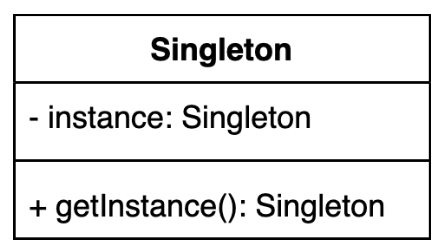

#### 싱글톤 (Singleton) 패턴
- 인스턴스를 오직 1개만 제공하는 클래스   
     

(1) private 생성자와 public static 메서드 사용하는 방법 (지연로딩)
- 멀티쓰레드에서 안전하지 않다. 최초 if 문을 수행하기 전, 여러 쓰레드가 접근시 new 객체가 생성된다.
```java
package com.designpattern.report._01_singleton.step1_lazy;

/**
 * private 생성자와 public static 메소드를 사용하는 방법
 */
public class Singleton {
    private static Singleton instance;

    /**
     * 이 코드가 안전한가?
     * 안전하지 않다.
     * 멀티쓰레드에 안전하게 사용해야할 필요가 있다.
     * 최초 if 문을 타기전에 여러 쓰레드가 들어오면 모두 new 객체가 생성된다.
     * @return
     */
    public static Singleton getInstance() {
        // 객체가 만들어지지않았을때
        if (instance == null) {
            instance = new Singleton();
        }

        return instance;
    }

    // private 생성자를 생성한다.
    // 오직 해당 파일 안에서만 new 연산자를 사용할 수 있다.
    private Singleton() {}
}

```    

(2) private 생성자와 public static 메서드 사용하는 방법 (즉시로딩)
- getInstance() 메서드를 어디서도 호출하지 않는다면, 안쓰는 객체를 미리 만들어놓는 상황이 된다.
```java
package com.designpattern.report._01_singleton.step2_eager;

/**
 * private 생성자와 public static 메소드를 사용하는 방법
 */
public class Singleton {
    // private static Settings1 instance;

    // 멀티쓰레드 오류 방지 - 이른 초기화(eager initialization)
    // 안쓰는 객체를 미리 만들어놓는 상황이 될수도 있다. (getInstance() 호출이 없을때)
    private static final Singleton INSTANCE = new Singleton();
    public static Singleton getInstance() {
        return INSTANCE;
    }

    // private 생성자를 생성한다.
    // 오직 해당 파일 안에서만 new 연산자를 사용할 수 있다.
    private Singleton() {}
}

```   

(3) 싱글톤 패턴 - Enum
- Enum의 기본 생성자는 default 가 private 접근제한자를 가진다.
- Enum은 리플렉션을 사용해도 객체를 생성할 수 없다.
- 단점 : 상속이 불가능하다.

```java
package com.designpattern.report._01_singleton.step3_enum;

import lombok.Getter;
import lombok.Setter;

/**
 * 단점 : Settings 를 로딩하는 순간 이미 객체를 만든다.
 *     : 상속을 쓰지 못한다.
 *
 * Enum 을 상속받고 있다. (serializable 을 지원받는다.)
 */
public enum EnumSingleton {
    INSTANCE; // EnumSingleton.INSTANCE

    // default 가 private
    private EnumSingleton() {

    }

    @Getter
    @Setter
    private Integer number;
}
```

(4) 싱글톤 패턴 - synchronized
```java
public class Singleton {
    private static Singleton INSTANCE;

    // private 생성자를 생성한다.
    // 오직 해당 파일 안에서만 new 연산자를 사용할 수 있다.
    private Singleton() {}

    // 동기 synchronized 처리
    // Lock 을 잡아서 Lock 을 가진 쓰레드만 접근가능하도록 하는 메커니즘이 필요하기 때문에 성능 이슈가 생길 수도 있다.
    public static synchronized Singleton getInstance() {
        // 객체가 만들어지지않았을때
        if (INSTANCE == null) {
            INSTANCE = new Singleton();
        }

        return INSTANCE;
    }
}
```


(5) 싱글톤 패턴 - volatile 키워드 
```java
public class SingletonSync {
    // volatile 키워드
    private static volatile SingletonSync instance;

    private SingletonSync() {}

    /**
     * 필요로한 시점에 만들 수 있다.
     * 하지만 이는, 아주 복잡한 방법이다. (volatile 키워드 필요)
     *
     * @return
     */
    public static SingletonSync getInstance() {
        // double checked locking
        // Lock (락을 잡아서 락을 가지고 있는 쓰레드만 이 영역에 접근이 가능하다.
        // 다 쓰고나면 Lock 이 해제되어 다른 쓰레드가 접근이 가능하다. (다시 Lock)

        // 엄청나게 많은 쓰레드가 if문 안으로 동시에 접근했을때
        // 그때를 대비해서만 synchronized 를 쓰기 때문에
        // 위에 메서드에 synchronized 가 있었던 (메서드 진입 시점에 막음) 보다 비용이 적음
        if (instance == null) {
            // 블록 안에서
            synchronized (SingletonSync.class) { // Settings1Sync.class 의 Lock 체크
                if (instance == null) {
                    instance = new SingletonSync();
                }
            }
        }

        return instance;
    }
}
```